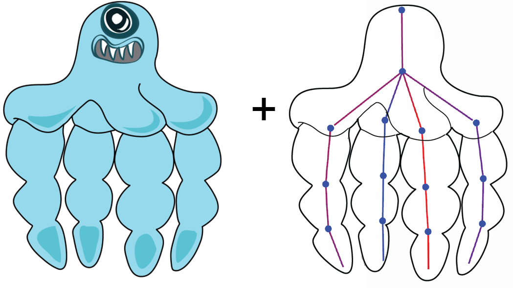
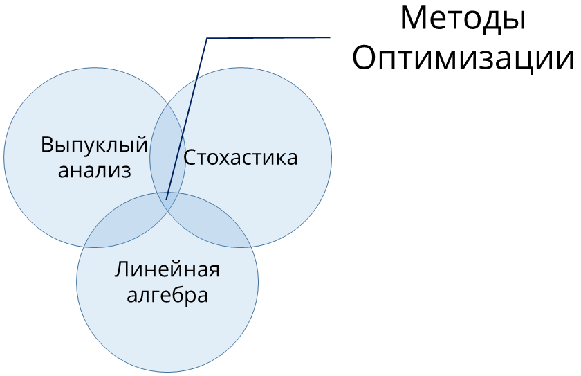
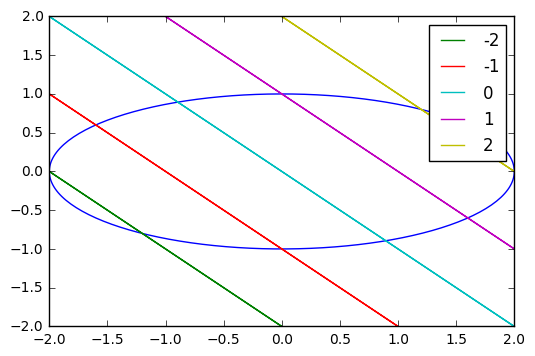
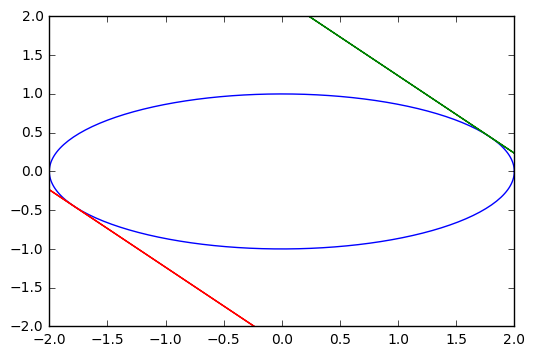

# Методы Оптимизации. Даниил Меркулов. Введение.

## Структура курса и семинаров

* Годовой курс. Осенний семестр теоретический. Весенний - практический.
* Экзамен после обоих семестров.
* _Лекции_ по средам в 10.45; _Семинары_ по вторникам в 17.05 907 КПМ
* На семинаре: краткий письменный опрос по материалам предыдущего семинара, обзор необходимой теории, решение задач, сдача домашнего задания

## Расписание (примерное)

* Неделя 1. Введение
* Неделя 2. Выпуклость. Выпуклое множество
* Неделя 3. Проекция точки на множество. Отделимость
* Неделя 4. Сопряженные множества. Лемма Фаркаша
* Неделя 5. Векторное дифференцирование
* Неделя 6. Выпуклые функции. Задачи выпуклого программирования
* Неделя 7. Субдифференциал
* Неделя 8. Промежуточная контрольная

* Неделя 9. Конус возможных направлений, касательный конус, острый экстремум
* Неделя 10. Сопряжённые функции
* Неделя 11. Условия оптимальности
* Неделя 12. Двойственная задача
* Неделя 13. Задача аппроксимации
* Неделя 14. Задачи линейной алгебры
* Неделя 15. Контрольная/ сдачи/ резерв

## Приём домашнего задания

* Домашнее задание оформляется в $ \LaTeX $ или `jupyter`. Другие формы (листочки, сканы тетрадки и пр.) не принимаются :(
* Задание отправляется **единым** файлом (форматы: `.pdf`, `.ipynb`, `.zip`, `.rar`) боту в telegram: https://t.me/optimization_hw_bot
* Возможно внесение исправлений/правок в отправленное дз. Тогда оно будет датироваться **последней** отправкой

* Каждое дз необходимо защитить устно, после чего за него будет выставлена оценка. Возможности для устной сдачи: Вторник 18.30 - 20.00. В любой другой день в Skoltech по предварительной договоренности.
* Дедлайны по каждой домашке: 1-ый до начала следующего семинара, 2-ой до конца следующей недели. После 1-ого и до 2-го дедлайнов дз стоит 80 % исходной цены, после 2-ого дедлайна дз стоит 50% исходной цены.

## Система оценивания


## Система анонимного фидбека

* После каждого семинара в канале публикуется ссылка с опросом о прошедшем семинаре. Это очень важно, оставьте пару комментариев - это анонимно.
  https://t.me/mipt_optimization

## Материалы

### Оптимизация
1. [Stephen Boyd, Lieven Vandenberghe. Convex Optimization](https://web.stanford.edu/~boyd/cvxbook/bv_cvxbook.pdf)

2. [Курс по выпуклой оптимизации в Stanford'e](https://web.stanford.edu/class/ee364a/)

3. [Курс по оптимизации L. Vandenberghe в UCLA](http://www.seas.ucla.edu/~vandenbe/ee236b/ee236b.html) 

4. [Материалы по оптимизации А.Катруцы ФУПМ МФТИ](https://github.com/amkatrutsa/MIPT-Opt) 

5. [Ю.Е. Нестеров. Методы выпуклой оптимизации](http://premolab.ru/pub_files/pub5/MnexoB89z7.pdf)

6. [Б.Т. Поляк. Введение в оптимизацию](https://mega.nz/#!fctUlQoZ!id1FfSYuJKZJPP8xrpR1lnfW4HhC8NJhbN0wyO_5S3I)

7. [Видео лекций S. Boyd'a по курсу Convex Optimization в Stanford'е](https://www.youtube.com/watch?v=McLq1hEq3UY&list=PL3940DD956CDF0622)

8. [Миникурс по выпуклой оптимизации от S. Boyd'a](http://stanford.edu/~boyd/papers/cvx_short_course.html)

9. [Convex Optimization: Algorithms and Complexity by S. Bubeck](https://mega.nz/#!CVcxyDCY!225VpAG7KC9V4wZ3zPwDUEotaw1pvnD9ArL6uVmLhB0)

10. [Matrix Cookbook](https://www.math.uwaterloo.ca/~hwolkowi/matrixcookbook.pdf)

### Материалы семинаров
2. [Быстрый просмотр семинаров](http://nbviewer.jupyter.org/github/Merkulovdaniil/mipt_optimization/tree/master/)
3. [Репозиторий на github](https://github.com/MerkulovDaniil/mipt_optimization)
4. [Канал в telegram](https://t.me/mipt_optimization); [Бот для сдачи дз в telegram](https://t.me/optimization_hw_bot)

###  $ \LaTeX $
1. [Ссылка на шаблон sharelatex для дз](https://www.sharelatex.com/project/59b1398c4caa997315dfbba9)
2. [Лекция "Latex для начинающих"](https://www.youtube.com/watch?v=hSc0H143ddw)
3. [Литература](https://mega.nz/#F!vBsU3KID!lg8OGbjGJUMb8FtMPLyclg) - Настольная книга, шпоргалка и краткое введение.

## Примеры задач оптимизации или чего можно достичь, изучая этот дивный мир

### Искусственный интеллект. Машинное обучение


### Задача выбора портфолио

* Переменные - количество денег, инвестируемых в конкретный актив
* Ограничения - бюджет, min/max необходимое количество инвестиций в актив(ы)
* Минимизируемый функционал: общий риск или дисперсия оценки возвращенных средств

### Индустрия мультипликации

[Статья](http://www.cs.ubc.ca/nest/imager/tr/2015/Canvases/CameraReady.pdf)

Вход: рисунок, скелет.


Выход: 3d модель, подобранная с помощью алгоритмов выпуклой оптимизации и корректно поставленной задачи оптимизации.


### Общая математическая формулировка

$$\text{minimize } f_0(x)$$
$$\text{subject to } f_i(x) \le b_i, i = 1, \ldots, m$$

* $x = (x_1, \ldots, x_n)$: оптимизируемые параметры (переменные)
* $f_0: \mathbf{R}^n \rightarrow \mathbf{R}$: целевая функция
* $f_i: \mathbf{R}^n \rightarrow \mathbf{R}, i = 1, \ldots, m$: ограничения

Решение $x^*$ доставляет наименьшее значение функции $f_0(x)$ среди всех $x$, удовлетворяющих ограничениям

### История и текущее положение дел

#### Теория
* 1900 - 1970: выпуклый анализ
* 1933+ : теория вероятностей, математическая статистика



#### Методы
* 1947: Симплексный метод решения задач линейного программирования (Данциг)
* 1960-ые: Методы внутренней точки 
* 1970-ые: Метод эллипоидов. Субградиентные методы
* 1980-ые: Методы внутренней точки, работающие за полиномиальное время для линейного программирования
* 1987+ : Методы внутренней точки для нелинейной выпуклой оптимизации (Немировский, Нестеров)
* 2000+ : Стохастические алгоритмы невыпуклой оптимизации


#### Приложения
* до 1990: в основном, исследование операций
* после 1990: бурное развитие приложений, обработка сигналов, разработка схем
* 2007+ : нейронные сети

## Пример решения задачи оптимизации с помощью геометрической интерпретации

### Пример 1

$\text{extr}\left(x_1 + x_2\right)$ при условии $x_1^2 + 4x_2^2 \le 4$

Решение:

* Не обязательно, но полезно посмотреть на иллюстрацию ниже, чтобы представить картину полностью (иллюстрацию можно двигать и увеличивать). На ней построена целевая функция во всех точках допустимого множества

Для столь простого примера экстремумы ясны сразу, тем не менее, воспользуемся стандартной геометрической процедурой поиска:
* Задача поиска экстремума заключается в поиске всех *инфимумов* (обратите внимание на написание), *супремумов*, *максимумов* и *минимумов* целевой функции из допустимого множества.
* Для того, чтобы найти точки максимума и минимума имеет смысл нарисовать линии уровня целевой функции в проекции на допустимое множество:


```python
import numpy as np
from matplotlib import pyplot as plt
%matplotlib inline

r = 1                 # radius
phi = np.linspace(0, 2*np.pi, 240)        # angle

r, phi = np.meshgrid(r, phi)              # computational grid

x1 = 2 * r * np.cos(phi)                         # parametrization
x2 = r * np.sin(phi)

plt.plot(x1,x2)
plt.plot(x1, -2-x1, label='-2')
plt.plot(x1, -1-x1, label='-1')
plt.plot(x1, -x1, label='0')
plt.plot(x1, 1-x1, label='1')
plt.plot(x1, 2-x1, label='2')
plt.ylim([-2,2])

plt.legend()

```


    <matplotlib.legend.Legend at 0x1bf4bd436a0>





Ясно, что максимум и минимум достигается на границе целевого множества, т.е. на пересечении прямой $x_2 = c - x_1$ и эллипса $x_1^2 + 4x_2^2 = 4$.
Решение задачи, доступное любому школьнику состоит в том, чтобы решить систему уравнений 
$$
 \begin{cases}
   x_2 = c - x_1, \\
   x_1^2 + 4x_2^2 = 4.
 \end{cases}
$$

При максимальном и минимальном допустимом значении $c$.

$$
\begin{cases}
   x_2 = c - x_1, \\
   5x_1^2 - 8c x_1 + 4c^2 - 4 = 0
\end{cases}
$$

$$D = 64 c^2 - 80 c^2 + 80 = 80 - 16c^2$$

$$x_1 = \dfrac{8c \pm \sqrt{80 - 16c^2}}{10}$$

Очевидно, что $c^2 \le 5 \rightarrow c_{min} = - \sqrt{5}, c_{max} = \sqrt{5}$

Значит, $x_1 = \dfrac{4}{5}c, \; x_2 = \dfrac{1}{5}c$, тогда $\left(\dfrac{4}{\sqrt{5}}, \dfrac{1}{\sqrt{5}}\right)$ - $max$, $\left(-\dfrac{4}{\sqrt{5}}, -\dfrac{1}{\sqrt{5}}\right)$ - $min$ 

В данной задаче супремум совпадает с точкой максимума, а инфимум с точкой минимума.
Действительно:


```python
plt.plot(x1,x2)
plt.plot(x1, np.sqrt(5)-x1, label='sqrt(5)')
plt.plot(x1, -np.sqrt(5)-x1, label='-sqrt(5)')
plt.ylim([-2,2])
```


    (-2, 2)





* Искомые точки так же можно было найти, приравняв [уравнение касательной к кривой второго порядка](https://ru.wikipedia.org/wiki/Кривая_второго_порядка) к $-1$ (угловому коэффициенту прямой уровней).
* Отметим так же, что ситуация, когда решение оптимизационной задачи лежат на границе допустимого множества - частое явление.

### Пример 2

$\text{extr}\left(\left|x_1\right|^\lambda + 2 \left|x_2\right|^\lambda \right)$ при условии $x_1^2 + 4x_2^2 \le 4, \;\; \lambda \neq 0$

Решение:

* Эта задача - с параметром $\lambda$, поэтому здесь очень важно рассмотреть все случаи. Для начала ограничимся положительными значениями $\lambda$. 
* Взгляните на рисунки при $\lambda < 1, \lambda = 1, \lambda > 1$.

По хорошему, задача решается абсолютно так же - рисованием линий уровней $f(x_1, x_2) = const$ и приравниванием уравнений касательных. Однако, в этой задаче ясно, что $(0, 0)$ - точка $min$ (она же инфимум этой задачи). Что же касается максимумов, давайте посмотрим:

$$
 \begin{cases}
   x_1^2 + 4x_2^2 = 4, \\
   \left|x_1\right|^\lambda + 2 \left|x_2\right|^\lambda = c
 \end{cases}
$$

В силу симметрии, можем рассмотреть лишь положительные значения $x_1, x_2$:

$$
 \begin{cases}
   x_1^2 + 4x_2^2 = 4, \\
   x_1^\lambda + 2 x_2^\lambda = c
 \end{cases}
$$

Вообще говоря, надо решить эту систему для всех $\lambda$ и максимального значения $c$, т.е. можно выразить $x_2 = x_2(x_1)$ и приравнять производные по $x_1$ первого и второго уравнений (условие касания). Особый интерес вызывает поведение решений при $\lambda \in (1,2)$, при всех остальных положительных значениях решения совпадают с теми, что указаны на рисунке выше. Читателю предлагается придумать способ найти аналитическое решение в этом случае.

В случае же $\lambda <0$ точка $(0,0)$ является супремумом целевой функции на заданном множестве. И эту точку стоит включить в ответ. Графики ниже.

## Домашнее задание 1
Используя геометрические интерпретации, решить следующие экстремальные задачи:
1. $\text{extr}\left(\left|x_1\right|^\lambda + 2 \left|x_2\right|^\lambda \right)$ при условии $x_1^2 + 4x_2^2 = 4, \;\; \lambda \neq 0$

2. $\text{extr}\left(x_1^2 + 4x_2^2\right)$ при условии $\left|x_1\right|^\lambda + 2 \left|x_2\right|^\lambda \le 1, \;\; \lambda \neq 0$

3. $\text{extr}\left(x_1^2 + 4x_2^2\right)$ при условии $\left|x_1\right|^\lambda + 2 \left|x_2\right|^\lambda = 1, \;\; \lambda \neq 0$

В качестве решения необходимо предоставить либо:
- `jupyter notebook` с построенными графиками целевой функции и бюджетного множества, описывающие различные параметры $\lambda$. Для построения графиков можно использовать код указанный в этом семинаре, но будет проще рабоать с библиотекой `matplotlib`
- Аналитическое решение при $\lambda \in Z \neq 0$ с рассмотрением всех случаев

Плюсом будут отмечены те решения, что рассмотрят $\lambda \in R \backslash \{0\}$
