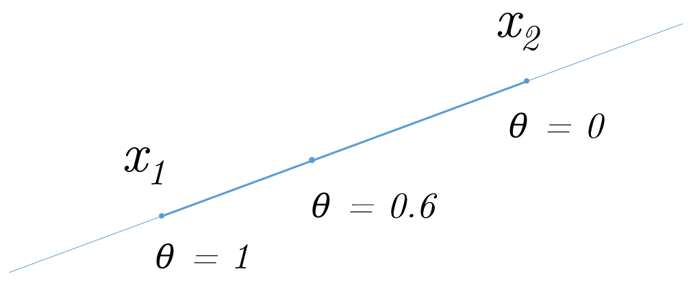
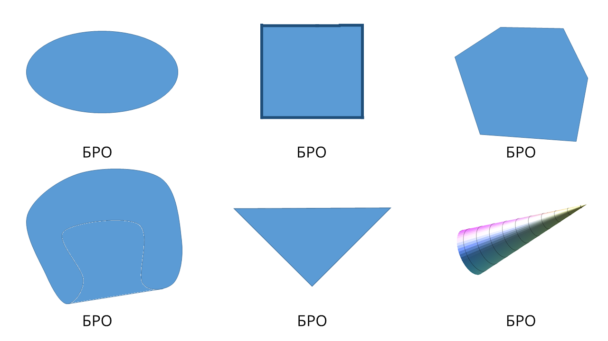

# Методы Оптимизации. Даниил Меркулов. Выпуклость. Выпуклые множества.

## Affine set
Даны 2 точки $x_1, x_2$. Тогда прямая, проходящая через них определяется следующим образом:
$$x = \theta x_1 + (1 - \theta)x_2, \theta \in \mathbb{R}$$

### Афинное множество
Множество $A$ называется афинным, если для любых $x_1, x_2$ из $A$ прямая, проходящая через них так же лежит в $A$, т.е. $$\forall \theta \in \mathbb{R}, \forall x_1, x_2 \in A: \theta x_1 + (1- \theta) x_2 \in A$$

#### Примеры: 
$\mathbb{R}^n$, множество $ \left\{ x \mid \mathbf{A}x = \mathbf{b}\right\} $

### Афинная комбинация
Пусть $x_1, x_2, \ldots, x_k \in S$, тогда точка $\theta_1 x_1 + \theta_2 x_2 + \ldots + \theta_k x_k$ называется афинной комбинацией точек $x_1, x_2, \ldots, x_k$ при условии $\sum\limits_{i=1}^k\theta_i = 1$

### Афинная оболочка
Наименьшее множество всех афинных комбинаций точек множества $S$ называется афинной оболочкой множества $S$.
$$\mathbf{aff}(S) = \left\{ \sum\limits_{i=1}^k\theta_i x_i \mid x_i \in S, \sum\limits_{i=1}^k\theta_i = 1\right\}$$

## Convex set
Даны 2 точки $x_1, x_2$. Тогда отрезок, соединяющий их определяется следующим образом:
$$x = \theta x_1 + (1 - \theta)x_2, \theta \in [0,1]$$

### Выпуклое множество
Множество $C$ называется выпуклым, если для любых $x_1, x_2$ из $A$ отрезок, соединяющий их, так же лежит в $C$, т.е. 

$$\forall \theta \in [0,1], \forall x_1, x_2 \in C: \\ \theta x_1 + (1- \theta) x_2 \in C $$

#### Примеры: 
Любое афинное множество, луч, отрезок.

### Выпуклая комбинация
Пусть $x_1, x_2, \ldots, x_k \in S$, тогда точка $\theta_1 x_1 + \theta_2 x_2 + \ldots + \theta_k x_k$ называется выпуклой комбинацией точек $x_1, x_2, \ldots, x_k$ при условии $\sum\limits_{i=1}^k\theta_i = 1, \theta_i \ge 0$

### Выпуклая оболочка
Наименьшее множество всех выпуклых комбинаций точек множества $S$ называется выпуклой оболочкой множества $S$.
$$\mathbf{conv}(S) = \left\{ \sum\limits_{i=1}^k\theta_i x_i \mid x_i \in S, \sum\limits_{i=1}^k\theta_i = 1, \theta_i \ge 0\right\}$$

#### Примеры:

### Неуловимая выпуклость

На практике очень важно бывает понять, выпукло конкретное множество или нет. Для этого применяют 2 подхода в зависимости от контекста.
#### По определению
#### Показать, что $S$ получено из простых выпуклых множеств с помощью операций, сохраняющих выпуклость:

#### По определению
$$x_1, x_2 \in S,  0 \le \theta \le 1 \;\; \rightarrow \;\; \theta x_1 + (1-\theta)x_2 \in S$$

#### Показать, что $S$ получено из простых выпуклых множеств с помощью операций, сохраняющих выпуклость:

##### Линейная комбинация выпуклых множеств выпукла

Пусть есть 2 выпуклых множества $S_x, S_y$, пусть множество $S = \left\{s \mid s = c_1 x + c_2 y, x \in S_x, y \in S_y, c_1, c_2 \in \mathbb{R}\right\}$

Возьмем две точки из $S$: $s_1 = c_1 x_1 + c_2 y_1, s_2 = c_1 x_2 + c_2 y_2$ и докажем, что отрезок между ними $\theta s_1 + (1 - \theta)s_2, \theta \in [0,1]$ так же принадлежит $S$

$$\theta s_1 + (1 - \theta)s_2$$

$$\theta (c_1 x_1 + c_2 y_1) + (1 - \theta)(c_1 x_2 + c_2 y_2)$$

$$c_1 (\theta x_1 + (1 - \theta)x_2) + c_2 (\theta y_1 + (1 - \theta)y_2)$$

$$c_1 x + c_2 y \in S$$

##### Пересечение любого (!) числа выпуклых множеств выпукло

Если искомое пересечение пусто или содержит одну точку - свойство доказано по определению. В противном случае возьмем 2 точки и отрезок между ними. Эти точки должны лежать во всех пересекаемых множествах, а так как все они выпуклы, то и отрезок между ними лежит во всех множествах, а значит и в их пересечении.

#####  Образ выпуклого множества при афинном отображении выпуклый

$$S \subseteq \mathbb{R}^n \text{ convex}\;\; \rightarrow \;\; f(S) = \left\{ f(x) \mid x \in S \right\} \text{ convex} \;\;\;\; \left(f(x) = \mathbf{A}x + \mathbf{b}\right)$$

Примеры афинных функций: растяжение, проекция, перенос, множество решений линейного матричного неравенства $\left\{ x \mid x_1 A_1 + \ldots + n_m A_m \preceq B\right\}$ Здесь $A_i, B \in \mathbf{S}^p$ - симметричные матрицы $p \times p$. 

Отметим так же, что прообраз выпуклого множества при афинном отображении так же выпуклый.

$$S \subseteq \mathbb{R}^m \text{ convex}\; \rightarrow \; f^{-1}(S) = \left\{ x \in \mathbb{R}^n \mid f(x) \in S \right\} \text{ convex} \;\; \left(f(x) = \mathbf{A}x + \mathbf{b}\right)$$

## Convex cone

### Выпуклый конус
Множество $S$ называется выпуклым конусом, если:

$$\forall x_1, x_2 \in S, \theta_1, \theta_2 \ge 0 \;\; \rightarrow \;\; \theta_1 x_1 + \theta_2 x_2 \in S$$

#### Примеры:
$\mathbb{R}^n$; афинное множество, содержащее $0$; луч, $\mathbf{S}^n_+$ - множество симметричных положительно определенных матриц

### Неотрицательная коническая комбинация точек
Пусть $x_1, x_2, \ldots, x_k \in S$, тогда точка $\theta_1 x_1 + \theta_2 x_2 + \ldots + \theta_k x_k$ называется неотрицательной конической комбинацией точек $x_1, x_2, \ldots, x_k$ при условии $\theta_i \ge 0$

### Коническая оболочка точек
Наименьшее множество всех неотрицательных конических комбинаций точек множества $S$ называется конической оболочкой множества $S$.
$$\mathbf{cone}(S) = \left\{ \sum\limits_{i=1}^k\theta_i x_i \mid x_i \in S, \theta_i \ge 0\right\}$$

## Примеры решения задач

### Пример 1
Покажите, что множество выпукло тогда и только тогда, когда его пересечение с любой прямой выпукло.

Решение:
1. Заметим, что прямая - выпуклое множество, а пересечение двух выпуклых множетсв всегда выпукло. Таким образом, если множество выпукло, то его пересечение с любой прямой выпукло.
2. Теперь пусть пересечение множества $S$ с любой прямой выпукло. Возьмем произвольные точки $x_1, x_2 \in S$. Пересечение $S$ и прямой через $x_1, x_2$ выпукло, т.е. содержит отрезок между $x_1$ и $x_2$. Если любое пересечение содержит две точки и отрезок между ними, то и множество $S$ его так же содержит, а стало быть - выпукло.

### Пример 2
Покажите, что выпуклая оболочка множества $S$ есть пересечение всех выпуклых множеств, содержащих $S$.

Решение:
1. Обозначим за $H$ выпуклую оболочку множества $S$, а за $I$ - пересечение всех выпуклых множеств, содержащих $S$. Таким образом:

    $H = \mathbf{conv}(S)$

    $I = \bigcap \{I_s \mid I_s \text{ - convex }, I_s \supseteq S\}$

    Требуется доказать, что $H = I$. 

2. Пусть $x \in H$, т.е. $x$ - выпуклая комбинация некоторых точек $x_1, \ldots, x_k \in S$. Теперь пусть $I_s$ - некоторое выпуклое множество содержащее $S$: $I_s \supseteq S$. Значит эта выпуклая комбинация точек $x_1, \ldots, x_k \in S \in I_s$ лежит и в $I_s$, так как оно выпукло (и содержит все выпуклые комбинации своих точек), т.е. $x \in I_s$. Но $I_s$ - произвольное выпуклое множество, содержащее $x$, а значит, $x \in \bigcap I_s$ или  $I$. Таким образом $H \subseteq I$

3. Заметим, что выпуклая оболочка выпукла и содержит исходное множество, а значит, сама по себе является одним из тех множеств, которые мы пересекаем для построения $I$, т.е. $I_s = H$. А значит, $I \subseteq H$.

4. Широкий взгляд на предыдущие два пункта завершает доказательство.

### Пример 3
Пусть $x \in \mathbb{R}$ - случайная величина с заданным вероятностным распределением $\mathbb{P}(x = a_i) = p_i$, где $i = 1, \ldots, n$, а $a_1 < \ldots < a_n$. Говорят, что вектор вероятностей исходов $p \in \mathbb{R}^n$ принадлежит вероятностному симплексу, т.е. $P = \left\{ p \mid \mathbf{1}^Tp = 1, p \succeq 0\right\} = \left\{ p \mid p_1 + \ldots + p_n = 1, p_i \ge 0 \right\}$. 
​    
Определите, выпукло ли множество таких $p$, которые удовлетворяют условию:

* $\alpha < \mathbb{E} f(x) < \beta$, где $\mathbb{E}f(x)$ означает математическое ожидание заданной функции $f(x): \mathbb{R} \rightarrow \mathbb{R}$, т.е. $\mathbb{E}f(x) = \sum\limits_{i=1}^n p_i f(a_i)$

По условию: $\alpha < \sum\limits_{i=1}^n p_i f(a_i) < \beta$. Это означает, что на $p$ наложено два линейных неравенства, каждое из которых определяет выпуклое множество (полупространство), что в пересечении с выпуклым симплексом даст выпуклое множество.

* $\mathbb{E}x^2 \le \alpha$

 По условию: $\sum\limits_{i=1}^n p_i a_i^2 \le \alpha$. Это условие является линейным неравенством, что так же задает выпуклое множество ограничений, что в пересечении с симплексом дает выпуклое множество.

* $\mathbb{V}x \le \alpha$

По условию: $\mathbb{V}x = \mathbb{E}\left\{ (x - \mathbb{E}x)^2\right\} = \mathbb{E}x^2 - \left(\mathbb{E}x\right)^2$ = $\sum\limits_{i=1}^n p_i a_i^2 - \left(\sum\limits_{i=1}^n p_i a_i\right)^2 \le \alpha$
​    
Множество, вообще говоря, не выпукло. Для этого достаточно ограничиться минимальным контрпримером, когда $n = 2$, а один из линейных коэффициентов равен $0$, а другой $1$, пусть $\alpha$ так же равен $\frac{1}{228}$: $p_2 - p_2^2 \le \dfrac{1}{228}$. Подставьте точки $(1,0)$ и $(0,1)$ - они удовлетворяют неравенству, в то время как середина отрезка между ними $(0.5, 0.5)$ этим свойством не обладает.

## Домашнее задание 2

0. Покажите, что множество афинно тогда и только тогда, когда его пересечение с любой прямой афинно.

1. Пусть $S_1, \ldots, S_k$ - произвольные непустые множества в $\mathbb{R}^n$. Докажите, что:
    * $ \mathbf{cone} \left( \bigcup\limits_{i=1}^k S_i\right) = \sum\limits_{i=1}^k \mathbf{cone} \left( S_i\right) $
    * $ \mathbf{conv} \left( \sum\limits_{i=1}^k S_i\right) = \sum\limits_{i=1}^k \mathbf{conv} \left( S_i\right) $
2. Докажите, что множество $S \subseteq \mathbb{R}^n$ выпукло тогда и только тогда, когда $(\alpha + \beta)S = \alpha S + \beta S$ для всех неотрицательных $\alpha$ и $\beta$

3. Пусть $x \in \mathbb{R}$ - случайная величина с заданным вероятностным распределением $\mathbb{P}(x = a_i) = p_i$, где $i = 1, \ldots, n$, а $a_1 < \ldots < a_n$. Говорят, что вектор вероятностей исходов $p \in \mathbb{R}^n$ принадлежит вероятностному симплексу, т.е. $P = \left\{ p \mid \mathbf{1}^Tp = 1, p \succeq 0\right\} = \left\{ p \mid p_1 + \ldots + p_n = 1, p_i \ge 0 \right\}$. 

    Определите, выпукло ли множество таких $p$, которые удовлетворяют условию:

    * $\mathbb{P}(x > \alpha) \le \beta$
    * $\mathbb{E} |x^{2017}| \le \alpha \mathbb{E}|x|$
    * $\mathbb{E} |x^{2}| \ge \alpha $
    * $\mathbb{V}x \ge \alpha$

В качестве решения необходимо предоставить либо:
- `.pdf` файл, сверстанный с помощью $ \LaTeX $ с решениями задач
- `.ipynb` с оформленным решением

