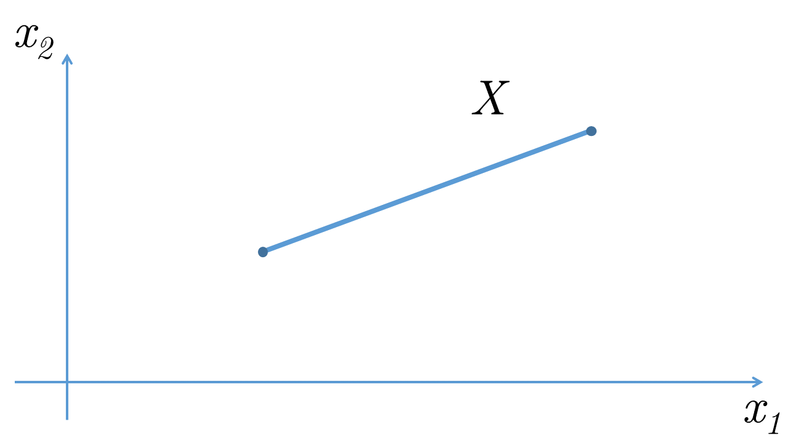
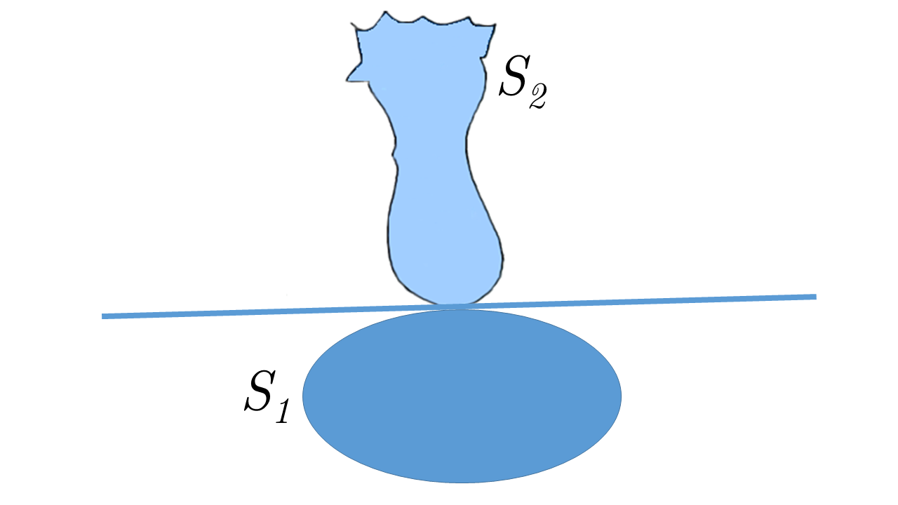
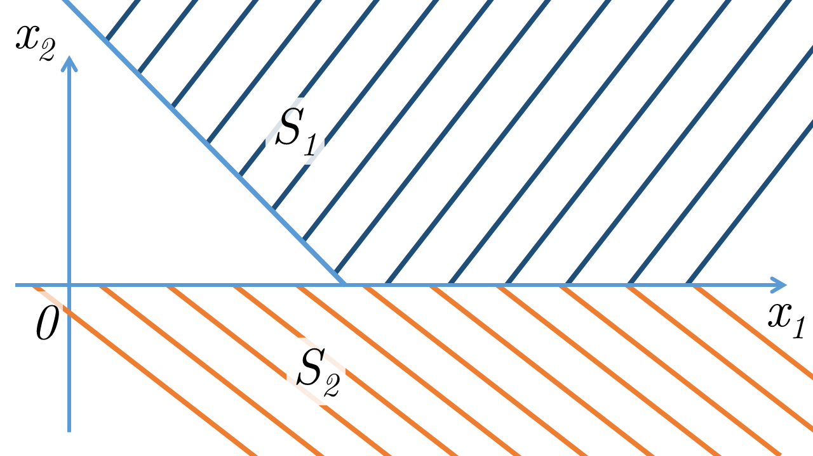
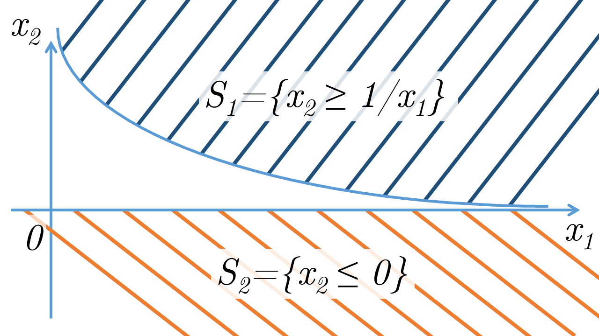
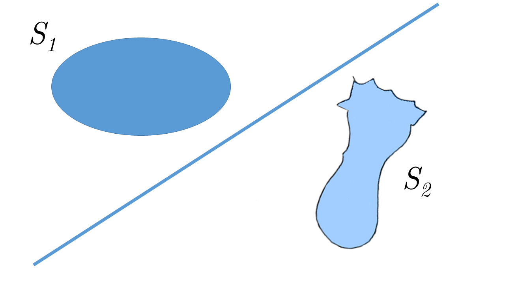
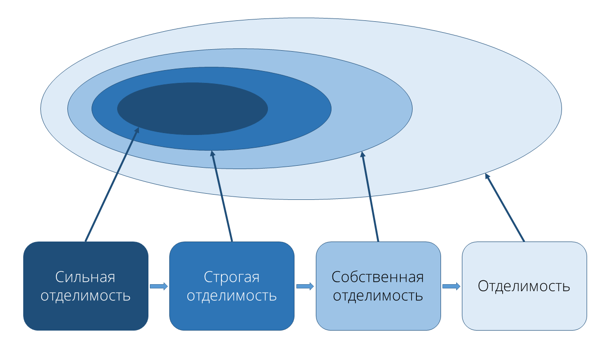

# Методы Оптимизации. Даниил Меркулов. Отделимость. Проекция. Опорная гиперплоскость

## Interior
### Внутренность множества
Внутренностью множества $S$ называется следующее множество: 
$$\mathbf{int} (S) = \{\mathbf{x} \in S \mid \exists \varepsilon > 0, B(\mathbf{x}, \varepsilon) \subset S\}$$
где $B(\mathbf{x}, \varepsilon) = \mathbf{x} + \varepsilon B$ - шар с центром в т.$\mathbf{x}$ и радиусом $\varepsilon$

### Относительная внутренность множества
Относительной внутренностью множества $S$ называется следующее множество: 
$$\mathbf{relint} (S) = \{\mathbf{x} \in S \mid \exists \varepsilon > 0, B(\mathbf{x}, \varepsilon) \cap \mathbf{aff} (S) \subseteq S\}$$

* Любое непустое выпуклое множество $S \subseteq \mathbb{R}^n$ имеет непустую относительную внутренность $\mathbf{relint}(S)$

## Projection
### Расстояние между точкой и множеством
Расстоянием $d$ от точки $\mathbf{y} \in \mathbb{R}^n$ до замкнутого множества $S \subset \mathbb{R}^n$ является:
$$d(\mathbf{y}, S, \| \cdot \|) = \inf\{\|x - y\| \mid x \in S \}$$

### Проекция точки на множество
Проекцией точки $\mathbf{y} \in \mathbb{R}^n$ на множество $S \subseteq \mathbb{R}^n$ называется точка $\pi_S(\mathbf{y}) \in S$: $$\| \pi_S(\mathbf{y}) - \mathbf{y}\| \le \|\mathbf{x} - \mathbf{y}\|, \forall \mathbf{x} \in S$$

* Если множество - открыто, и точка в нем не лежит, то её проекции на это множество не существует
* Если точка лежит в множестве, то её проекция - это сама точка
* $$\pi_S(\mathbf{y}) = \underset{\mathbf{y}}{\operatorname{argmin}} \|\mathbf{x}-\mathbf{y}\|$$
* Пусть $S \subseteq \mathbb{R}^n$ - выпуклое замкнутое множество. Пусть так же имеются точки $\mathbf{y} \in \mathbb{R}^n$ и $\mathbf{\pi} \in S$. Тогда если для всех $\mathbf{x} \in S$ справедливо неравенство: $$\langle \pi  -\mathbf{y}, \mathbf{x} - \pi\rangle \ge 0, $$ то $\pi$ является проекцией точки $\mathbf{y}$ на $S$, т.е. $\pi_S (\mathbf{y}) = \pi$
* Пусть $S \subseteq \mathbb{R}^n$ - афинное множество. Пусть так же имеются точки $\mathbf{y} \in \mathbb{R}^n$ и $\mathbf{\pi} \in S$. Тогда $\pi$ является проекцией точки $\mathbf{y}$ на $S$, т.е. $\pi_S (\mathbf{y}) = \pi$ тогда и только тогда, когда для всех $\mathbf{x} \in S$ справедливо равенство: $$\langle \pi  -\mathbf{y}, \mathbf{x} - \pi\rangle = 0 $$ 

#### Пример 1
Найти $\pi_S (y) = \pi$, если $S = \{x \in \mathbb{R}^n \mid \|x - x_c\| \le R \}$, $y \notin S$

Решение:

* Из рисунка строим гипотезу: $\pi = x_0 + R \cdot \frac{y - x_0}{\|y - x_0\|}$

* Проверяем неравенство для выпуклого замкнутого множества: $(\pi - y)^T(x - \pi) \ge 0$

$$\left( x_0 - y + R \frac{y - x_0}{\|y - x_0\|} \right)^T\left( x - x_0 - R \frac{y - x_0}{\|y - x_0\|} \right) =$$
$$\left( \frac{(y - x_0)(R - \|y - x_0\|)}{\|y - x_0\|} \right)^T\left( \frac{(x-x_0)\|y-x_0\|-R(y - x_0)}{\|y - x_0\|} \right) =$$
$$\frac{R - \|y - x_0\|}{\|y - x_0\|^2} \left(y - x_0 \right)^T\left( \left(x-x_0\right)\|y-x_0\|-R\left(y - x_0\right) \right) = $$

$$\frac{R - \|y - x_0\|}{\|y - x_0\|} \left( \left(y - x_0 \right)^T\left( x-x_0\right)-R\|y - x_0\| \right) =$$

$$\left(R - \|y - x_0\| \right) \left( \frac{(y - x_0 )^T( x-x_0)}{\|y - x_0\|}-R \right)$$

Первый сомножитель отрицателен по выбору точки $y$. Второй сомножитель так же отрицателен, если применить к его записи теорему Коши - Буняковского: $$(y - x_0 )^T( x-x_0) \le \|y - x_0\|\|x-x_0\|$$
$$\frac{(y - x_0 )^T( x-x_0)}{\|y - x_0\|} - R \le \frac{\|y - x_0\|\|x-x_0\|}{\|y - x_0\|} - R = \|x - x_0\| - R \le 0$$

#### Пример 2
Найти $\pi_S (y) = \pi$, если $S = \{x \in \mathbb{R}^n \mid c^T x = b \}$, $y \notin S$

Решение:

* Из рисунка строим гипотезу: $\pi = y + \alpha c$. Коэффициент $\alpha$ подбирается так, чтобы $\pi \in S$: $c^T \pi = b$, т.е.: $$c^T (y + \alpha c) = b$$
  $$c^Ty + \alpha c^T c = b$$
  $$c^Ty = b - \alpha c^T c$$

* Проверяем неравенство для выпуклого замкнутого множества: $(\pi - y)^T(x - \pi) \ge 0$
  $$(y + \alpha c - y)^T(x - y - \alpha c) = $$
  $$ \alpha c^T(x - y - \alpha c) = $$
  $$ \alpha (c^Tx) - \alpha (c^T y) - \alpha^2 c^Tc) = $$
  $$ \alpha b - \alpha (b - \alpha c^T c) - \alpha^2 c^Tc = $$
  $$ \alpha b - \alpha b + \alpha^2 c^T c - \alpha^2 c^Tc = 0 \ge 0$$

#### Пример 3
Найти $\pi_S (y) = \pi$, если $S = \{x \in \mathbb{R}^n \mid Ax = b, A \in \mathbb{R}^{m \times n},  b \in \mathbb{R}^{m} \}$, $y \notin S$

Решение:

* Из рисунка строим гипотезу: $\pi = y + \sum\limits_{i=1}^m\alpha_i A_i = y + A^T \alpha$. Коэффициент $\alpha$ подбирается так, чтобы $\pi \in S$: $A \pi = b$, т.е.: $$c^T (y + A^T \alpha) = b$$
  $$A(y + A^T\alpha) = b$$
  $$Ay = b - A A^T\alpha$$

* Проверяем неравенство для выпуклого замкнутого множества: $(\pi - y)^T(x - \pi) \ge 0$
  $$(y + A^T\alpha  - y)^T(x - y - A^T\alpha) = $$
  $$ \alpha^T A(x - y - A^T\alpha) = $$
  $$ \alpha^T (Ax) - \alpha^T (A y) - \alpha^T AA^T \alpha) = $$
  $$ \alpha^T b - \alpha^T (b - A A^T\alpha) - \alpha^T AA^T \alpha = $$
  $$ \alpha^T b - \alpha^T b + \alpha^T AA^T \alpha - \alpha^T AA^T \alpha = 0 \ge 0$$

## Separation
### Отделимые множества
Множества $S_1$ и $S_2$ называются отделимыми, если существуют $\mathbf{p} \neq \mathbf{0} \in \mathbb{R}^n$ и $\beta \in \mathbb{R}$, что:
$$\langle \mathbf{p}, \mathbf{x_1}\rangle \le \beta \le \langle \mathbf{p}, \mathbf{x_2}\rangle, \;\; \forall \mathbf{x_1} \in S_1, \;\; \forall \mathbf{x_2} \in S_2$$

### Собственно отделимые множества
Множества $S_1$ и $S_2$ называются собственно отделимыми, если они отделимы и дополнительно можно указать такие $\mathbf{x_1} \in S_1,  \mathbf{x_2} \in S_2$
$$\langle \mathbf{p}, \mathbf{x_1}\rangle < \langle \mathbf{p}, \mathbf{x_2}\rangle$$

### Строго отделимые множества
Множества $S_1$ и $S_2$ называются строго отделимыми, если существует $\mathbf{p} \neq \mathbf{0} \in \mathbb{R}^n$, что:
$$\langle \mathbf{p}, \mathbf{x_1}\rangle < \langle \mathbf{p}, \mathbf{x_2}\rangle, \;\; \forall \mathbf{x_1} \in S_1, \;\; \forall \mathbf{x_2} \in S_2$$

### Сильно отделимые множества
Множества $S_1$ и $S_2$ называются сильно отделимыми, если существуют $\mathbf{p} \neq \mathbf{0} \in \mathbb{R}^n$ и $\beta \in \mathbb{R}$, что:
$$ \underset{\mathbf{x_1} \in S_1}{\operatorname{sup}} \langle \mathbf{p}, \mathbf{x_1}\rangle < \beta < \underset{\mathbf{x_2} \in S_2}{\operatorname{inf}}\langle \mathbf{p}, \mathbf{x_2}\rangle, \;\; \forall \mathbf{x_1} \in S_1, \;\; \forall \mathbf{x_2} \in S_2$$

### Расстояние между множествами
Расстоянием между множествами $S_1$ и $S_2$ называется число:
$$d(S_1, S_2,\| \cdot \|) = \underset{\mathbf{x_1} \in S_1, \mathbf{x_2} \in S_2}{\operatorname{inf}} \|\mathbf{x_1} - \mathbf{x_2}\|$$

* Если $X$ и $Y$ - непустые выпуклые множества в $\mathbb{R}^n$ и $X \cap Y = \emptyset$, тогда $X$ и $Y$ - отделимы.
* Если $X$ - непустое выпуклое замкнутое множество в $\mathbb{R}^n$ и $\mathbf{y} \notin X$, тогда точку $\mathbf{y}$ можно строго отделить от множества $X$.

## Supporting hyperplane
### Опорная гиперплоскость
Гиперплоскость $\Gamma_{p,\beta} = \left\{\mathbf{x} \in \mathbb{R}^n : \langle p, \mathbf{x} \rangle = \beta \right\}$ называется опорной к множеству $S$ в граничной точке $\mathbf{a} \in \partial S$, если $$\langle p, \mathbf{x} \rangle \ge \beta = \langle p, \mathbf{a} \rangle \;\; \forall \mathbf{x} \in S$$

Опорная гиперплоскость называется *собственно опорной*, если, кроме того, можно указать $\mathbf{x_0} \in S: \langle p, \mathbf{x_0} \rangle > \beta$

* В любой граничной (относительно граничной) точке выпуклого множества существует опорная (собственно опорная) гиперплоскость.
* Касательная плоскость к поверхности $F(x) = 0,$ где  $F: \mathbb{R}^n \rightarrow \mathbb{R}^1$ в точке $x_0$ определяется уравнением: $$\nabla F(x_0)^T(x-x_0) = 0$$
* Касательная плоскость к графику функции $f(x),$ где  $f: \mathbb{R}^n \rightarrow \mathbb{R}^1$ в точке $x_0$ определяется уравнением: $$\phi(x) = f(x_0) + \nabla f(x_0)^T(x-x_0) = 0$$

#### Пример 4
Построить гиперплоскость, разделяющую $S_1$ и $S_2$:
$$S_1 = \left\{ x \in \mathbb{R}^2 \mid x_1 x_2 \ge 1, x_1 > 0\right\}, \;\;\; S_2 = \left\{ x \in \mathbb{R}^2 \mid x_2 \le \frac{4}{x_1 - 1} +9\right\}$$

Решение: 
* Найдем $\partial S_1 \cap \partial S_2$:
$$
 \begin{cases}
   x_1 x_2 = 1 \\
   x_2 = \frac{4}{x_1 - 1} +9
 \end{cases}
$$

$$
 \begin{cases}
   x_1 = \frac{1}{3} \\
   x_2 = 3
 \end{cases}
$$
т.е. множества пересекаются в точке $x_0 = (\frac{1}{3}, 3)$
* Построим касательные плоскости к обеим поверхностям в точке пересечения:
$$
 \begin{cases}
   \nabla F_1(x_0)^T(x-x_0) = 0 \\
   \nabla F_2(x_0)^T(x-x_0) = 0
 \end{cases}
$$

$$
 \begin{cases}
   3 x_1 + \frac{1}{3}x_2 - 2 = 0 \\
   -6 x_1 - \frac{2}{3}x_2 + 4 = 0
 \end{cases}
$$

Итого, получаем: $9x_1 + x_2 = 6$, т.е. $p = (9,1), \beta = 6$

#### Пример 5
Построить опорную гиперплоскость для множества $S = \left\{ x \in \mathbb{R}^2 \mid e^{x_1} \le x_2\right\}$ в граничной точке $x_0 = (0,1)$

Решение:

* Имеем поверхность $F(x_1, x_2) = e^{x_1} - x_2, \;\;\; \nabla F = (e^{x_1}, -1), \;\;\; \nabla F(x_0) = (1,-1)$
* Тогда $$\nabla F(x_0)^T(x-x_0) = 0$$
  $$(1,-1)^T (x_1, x_2 - 1) = 0$$
* Искомая опорная гиперплоскость: $x_1 - x_2 + 1 = 0$

#### Пример 6
Построить опорную гиперплоскость для множества $S = \left\{ x \in \mathbb{R}^3 \mid x_3 \ge x_1^2 + x_2^2\right\}$ так, чтобы она отделяла его от точки $x_0 = \left(-\frac{5}{4}, \frac{5}{16}, \frac{15}{16}\right)$

Решение:

* Заметим, что здесь $x_0 \notin \partial S$. А значит, таких гиперплоскостей много. Возможный вариант: искать опорную гиперплоскость в точке $\pi_S(x_0) = \pi \in S$. Значит, $\Gamma_{p, \beta} = \left\{ x \in \mathbb{R}^3 \mid p^Tx = \beta, p^T \pi = \beta \right\}$

* Будем искать $\pi$, решая задачу минимизации: 

$$\underset{x \in \partial S}{\operatorname{min}}\|x - x_0\|^2$$
$$\underset{x \in \partial S}{\operatorname{min}}(x - x_0)^T(x - x_0)$$

Учитывая структуру множества $\partial S = \{x \in \mathbb{R}^3 \mid x_3 = x_1^2 + x_2^2\}$, можем перейти к задаче безусловной минимизации.

$$ \left( x_1 + \frac{5}{4} \right)^2 + \left( x_2 - \frac{5}{16} \right)^2 + \left( x_1^2 + x_2^2 - \frac{15}{16} \right)^2 \rightarrow \operatorname{min}$$

Единственным решением которой является точка $\pi = \left( -1, \frac{1}{4}, \frac{17}{16}\right)$.

* Тогда $p = x_0 - \pi = \left( -\frac{1}{4}, \frac{1}{16}, -\frac{1}{8}\right), \;\; \beta = p^T \pi = \frac{17}{128}$

## Домашнее задание 3

0. Найти $\pi_S (y) = \pi$, если $S = \{x \in \mathbb{R}^n \mid c^T x \ge b \}$

1. Найти $\pi_S (y) = \pi$, если $S = \{x \in \mathbb{R}^n \mid x = x_0 + Xy, X \in \mathbb{R}^{n \times m},  y \in \mathbb{R}^{m}\}$, $y \notin S$

2. Построить гиперплоскость, разделяющую $S_1$ и $S_2$:
  $$S_1 = \left\{ x \in \mathbb{R}^n \mid x_1^2 + x_2^2 + \ldots + x_n^2 \le 1\right\}, \;\;\; S_2 = \left\{ x \in \mathbb{R}^n \mid x_1^2 + x_2^2 + \ldots + x_{n-1}^2 + 1 \le x_n \right\}$$

3. Построить опорную гиперплоскость для множества $S = \left\{ x \in \mathbb{R}^3 \mid \frac{x_1^2}{4}+\frac{x_2^2}{8}+\frac{x_3^2}{25} \le 1 \right\}$ в граничной точке $x_0 = (-\frac{6}{5}, \frac{12}{5}, 0)$

4. Пусть $X \subset \mathbb{R}^n$ - замкнутое выпуклое множество, $\mathbf{x} \in S$. Найти множество $Y \subset \mathbb{R}^n$ такое, что $\forall \mathbf{y} \in Y$ выполнено $\mathbf{x} = \pi_X(\mathbf{y})$

5. Пусть даны $\mathbf{x} \in \mathbb{R}^n$ и выпуклый конус $K \subseteq \mathbb{R}^n$. Пусть $Y = \mathbf{x} + K$, $\mathbf{y} \in Y$. Найти множество $X \subset \mathbb{R}^n$, такое, что $\mathbf{x} \in X, \forall \mathbf{y} \in Y: x = \pi_X(\mathbf{y})$

В качестве решения необходимо предоставить либо:
- `.pdf` файл, сверстанный с помощью $ \LaTeX $ с решениями задач
- `.ipynb` с оформленным решением

