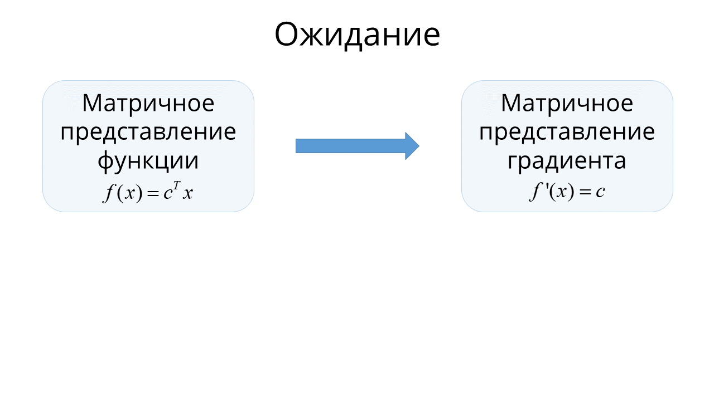
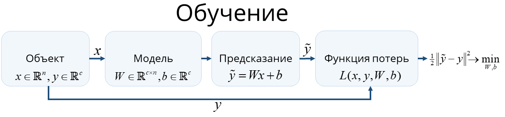

# Методы Оптимизации. Даниил Меркулов. Векторное дифференцирование.

## Базовые понятия
### Градиент
Пусть есть функция $f(x): \mathbb{R}^n \to \mathbb{R}$, тогда вектор, составленный из частных производных следующим образом:
$$
\nabla f(x) = \dfrac{df}{dx} = \begin{pmatrix}
    \frac{\partial f}{\partial x_1} \\
    \frac{\partial f}{\partial x_2} \\
    \vdots \\
    \frac{\partial f}{\partial x_n}
\end{pmatrix}
$$

называется градиентом функции $f(x)$. Этот вектор указывает направление наискорейшего возрастания в точке. Стало быть, вектор $- \nabla f(x)$ совпадает с направлением наискорейшего спуска для заданной функции в точке. Кроме того, вектор градиента в конкретной точке всегда перпендикулярен линии уровня функции, содержащей эту точку. 

Соответственно, 
$$
\nabla f(x)^T = \dfrac{df}{dx^T} = \left(\frac{\partial f}{\partial x_1}, \frac{\partial f}{\partial x_2}, \ldots, \frac{\partial f}{\partial x_n} \right)
$$

### Гессиан
Пусть есть функция $f(x): \mathbb{R}^n \to \mathbb{R}$, тогда матрица, составленная из смешанных производных второго порядка следующим образом:
$$
f''(x) = \dfrac{d(\nabla f)}{dx^T} = \dfrac{d\left(\nabla f^T\right)}{dx} = \begin{pmatrix}
    \frac{\partial^2 f}{\partial x_1 \partial x_1} & \frac{\partial^2 f}{\partial x_1 \partial x_2} & \dots  & \frac{\partial^2 f}{\partial x_1 \partial x_n} \\
    \frac{\partial^2 f}{\partial x_2 \partial x_1} & \frac{\partial^2 f}{\partial x_2 \partial x_2} & \dots  & \frac{\partial^2 f}{\partial x_2 \partial x_n} \\
    \vdots & \vdots & \ddots & \vdots \\
    \frac{\partial^2 f}{\partial x_n \partial x_1} & \frac{\partial^2 f}{\partial x_n \partial x_2} & \dots  & \frac{\partial^2 f}{\partial x_n \partial x_n}
\end{pmatrix}
$$
называется матрицей Гессе фугкции $f(x)$ и содержит в себе информацию о кривизне функции многих переменных в точке. Определитель этой матрицы называют гессианом функции $f(x)$ в точке. Эта матрица симметрична в том случае, когда порядок смешанного дифференциирования не важен, т.е. в случае, когда смешанные производные непрерывны.

Широко прянято называть гессианом не определитель матрицы Гессе, а саму матрицу, мы будем делать так же:) Положительная (отрицательная) определенность гессиана в точке является достаточным условием локального минимума (максимума) функции в точке. 

Обобщением понятия гессиана на случай векторнозначной функции $\left(f(x): \mathbb{R}^n \to \mathbb{R}^m \right)​$ является трехмерный тензор, состоящий из гессианов по каждой компоненте вектор - функции: 
$$
\left( H\left(f_1(x)\right), H\left(f_2(x)\right), \ldots, H\left(f_m(x)\right)\right)
$$

### Якобиан
Для функции $f(x): \mathbb{R}^n \to \mathbb{R}^m$ вводится понятие матрицы Якоби:
$$
f'(x) = \dfrac{df}{dx^T} = \begin{pmatrix}
    \frac{\partial f_1}{\partial x_1} & \frac{\partial f_1}{\partial x_2} & \dots  & \frac{\partial f_1}{\partial x_n} \\
    \frac{\partial f_2}{\partial x_1} & \frac{\partial f_2}{\partial x_2} & \dots  & \frac{\partial f_2}{\partial x_n} \\
    \vdots & \vdots & \ddots & \vdots \\
    \frac{\partial f_m}{\partial x_1} & \frac{\partial f_m}{\partial x_2} & \dots  & \frac{\partial f_m}{\partial x_n}
\end{pmatrix}
$$
Если матрица квадратная, то её определитель называют якобианом функции $f(x)$. Часто саму матрицу так же называют якобианом. Если для некоторой функции в точке определитель матрицы Якоби отличен от нуля, то тогда и только тогда в окрестности этой точки существует обратная функция.

## Матричное дифференцирование
### Сводная таблица

$$
f(x) : X \to Y; \;\;\;\;\;\;\;\; \frac{\partial f(x)}{\partial x} \in G
$$

|             X             |       Y        |             G             |               Обозначение                |
| :-----------------------: | :------------: | :-----------------------: | :--------------------------------------: |
|       $\mathbb{R}$        |  $\mathbb{R}$  |       $\mathbb{R}$        |          $f'(x)$ (производная)           |
|      $\mathbb{R}^n$       |  $\mathbb{R}$  |      $\mathbb{R^n}$       | $\dfrac{\partial f}{\partial x_i}$ (градиент) |
|      $\mathbb{R}^n$       | $\mathbb{R}^m$ | $\mathbb{R}^{n \times m}$ | $\dfrac{\partial f_i}{\partial x_j}$ (якобиан) |
| $\mathbb{R}^{m \times n}$ |  $\mathbb{R}$  | $\mathbb{R}^{m \times n}$ |  $\dfrac{\partial f}{\partial x_{ij}}$   |

### Общая схема

### Дифференцирование сложной функции
* Пусть $x \in \mathbb{R}^n; \;\;\; g: \mathbb{R}^n \to \mathbb{R}^p;\;\;\; f : \mathbb{R}^p \to \mathbb{R}^1$

$$
\underset{n \times 1}{\dfrac{\partial f \left(g(x)\right)}{\partial x_j}} = \sum\limits_{i=1}^p\dfrac{\partial f}{\partial g_i} \cdot \dfrac{\partial g_i}{\partial x_j} = \underset{n \times p}{\dfrac{\partial g^T}{\partial x_j}} \cdot \underset{p \times 1}{\dfrac{\partial f}{\partial g}}
$$

* Для векторнозначной функции: пусть $x \in \mathbb{R}^n; \;\;\; g: \mathbb{R}^n \to \mathbb{R}^p;\;\;\; f : \mathbb{R}^p \to \mathbb{R}^m$

$$
\underset{m \times n}{\dfrac{\partial f \left(g(x)\right)}{\partial x^T}} = \underset{m \times p}{\dfrac{\partial f}{\partial g^T}} \cdot \underset{p \times n}{\dfrac{\partial g}{\partial x^T}}
$$

* Стало быть для $p = 1$: $x \in \mathbb{R}^n; \;\;\; g: \mathbb{R}^n \to \mathbb{R}^1;\;\;\; f : \mathbb{R}^1 \to \mathbb{R}^m$

$$
\underset{m \times n}{\dfrac{\partial f \left(g(x)\right)}{\partial x^T}} = \underset{m \times 1}{\dfrac{\partial f}{\partial g}} \cdot \underset{1 \times n}{\dfrac{\partial g}{\partial x^T}}
$$

* Еще один важный случай: $f: \mathbb{R}^n \to \mathbb{R}^m; \;\;\; \alpha: \mathbb{R}^n \to \mathbb{R}^1$
$$
\underset{m \times n}{\dfrac{d\left(\alpha(x)f(x)\right)}{dx^T}} = \alpha(x) \underset{m \times n}{\dfrac{df}{dx^T}} + \underset{m \times 1}{f(x)} \underset{1 \times n}{\dfrac{d\alpha(x)}{dx^T}}
$$

## Примеры
### Пример 1
Найти $\nabla f(x)$, если $f(x) = c^Tx$

Решение:

* $f(x) = \sum\limits_{i=1}^n c_i x_i$
* $\dfrac{\partial f(x)}{\partial x_i} = c_i \rightarrow \nabla f(x) = c$ 

### Пример 2
Найти $\nabla f(x)$, если $f(x) = \dfrac{1}{2}x^TAx + b^Tx + c$

Решение:

* $f(x) = \sum\limits_{i=1}^n\left[ \dfrac{1}{2}x_i \left(\sum\limits_{j=1}^n a_{ij}x_j \right) + b_ix_i + c_i\right] = \dfrac{1}{2} \sum\limits_{i,j=1}^n\left[ x_i a_{ij}x_j \right] + \sum\limits_{i=1}^n b_ix_i + c_i$
* $\dfrac{\partial f(x)}{\partial x_i} = \dfrac{1}{2}\sum\limits_{i,j=1}^n \left(a_{ij} + a_{ji}\right)x_i + b_i \rightarrow \nabla f(x) = \dfrac{1}{2} \left( A + A^T \right)x + b$ 

### Пример 3
Найти градиент билинейной формы $f(x) = u^T(x)Rv(x)$, $R \in \mathbb{R}^{m \times p}; \;\;\;u(x): \mathbb{R}^n \to \mathbb{R}^m; \;\;\;v(x): \mathbb{R}^n \to \mathbb{R}^p$

Решение:

$$
\dfrac{d\left( u^TRv\right)}{dx} = \dfrac{du^T}{dx}\left( \dfrac{\partial \left( u^TRv\right)}{\partial u}\right) + \dfrac{dv^T}{dx}\left( \dfrac{\partial \left( u^TRv\right)}{\partial v}\right) =  \dfrac{du^T}{dx}Rv + \dfrac{dv^T}{dx}R^Tu
$$

### Пример 4
Найти $\nabla f(x)$, если $f(x) = \dfrac{1}{2} \|Ax - b\|^2$

Решение:

Задачу можно решить двумя различными способами: как композицию функций $f(x) = \dfrac{1}{2}\|x\|^2; \;\;\;\; g(x) = Ax - b$, а так же классическим способом, рассмотрев скалярное представление функции.

Ответ: $\nabla f(x) = A^T(Ax - b)$

### Пример 5
Найти $\nabla f(x), f''(x)$, если $f(x) = -e^{-x^Tx}$

Решение: 

* Заметим, что задачу можно решить используя формулу для вычисления градиента сложной функции, однако мы, по старинке, распишем скалярный вид:
$$
f(x) = - e ^{-\sum\limits_i x_i^2}
$$
* Аккуратно посчитаем одну из компонент градиента:
$$
  \dfrac{\partial f(x)}{\partial x_k} = - e ^{-\sum\limits_i x_i^2} \cdot \left( \dfrac{\partial (-\sum\limits_i x_i^2)}{\partial x_k} \right) = e ^{-\sum\limits_i x_i^2} \cdot 2x_k
$$
  Значит, вектор градиента запишется, как: $\nabla f(x) = 2 e^{-x^Tx} \cdot x$
* Абсолютно по такой же логике посчитаем элемент гессиана. Обратите внимание на индексы! Типичная ошибка (недопонимание) здесь возникает, когда записывается везде $i,j$, бездумно повторяя индексы
$$
  g_k = \dfrac{\partial f(x)}{\partial x_k} \rightarrow H_{k,p} = \dfrac{\partial g_k}{\partial x_p}
$$
$$
  H_{k,p} = - \left( e ^{-\sum\limits_i x_i^2} \cdot 2x_p\right) 2x_k + 2 e ^{-\sum\limits_i x_i^2} \dfrac{\partial x_k}{\partial x_p} = 2 e ^{-\sum\limits_i x_i^2} \cdot \left( \dfrac{\partial x_k}{\partial x_p} - 2x_px_k\right)
$$

* Итого: $f''(x) = H_{f(x)} = 2e^{-x^Tx} \left( E - 2 xx^T\right)$

### Пример 6

Найти $f'(X)$, если $f(X) = \log\det X$; $X \in S^n_{++}$ - положительно определенная симметричная квадратная матрица

Решение:

* Применим хитрый трюк и вспомним об еще одном предназначении градиента и производной - линейная аппроксимация функции в окрестности точки.
  Заметим, что:

$$
\log\det\left[ X+ \Delta X\right] = \log \det \left[ X^{1/2} \left(I + X^{-1/2} \Delta X X^{-1/2}\right)X^{1/2}\right] = \\
\log \det \left[ X^{1/2} \right]\det \left[ I + X^{-1/2} \Delta X X^{-1/2}\right] \det \left[ X^{1/2}\right] =
$$
$$
= \log \det \left[ X \right]\det \left[ I + X^{-1/2} \Delta X X^{-1/2}\right]= \log \det \left[ X \right] + \log\det \left[ I + X^{-1/2} \Delta X X^{-1/2}\right]
$$

* Вспомним так же про то, что определитель матрицы равен произведению её собственных значений

$$
\log\det\left[ X+ \Delta X\right] = \log\det X + \sum\limits_{i=1}^n \log(1 + \lambda_i)
$$
    Здесь $\lambda_i$ - собственные числа матрицы $X^{-1/2} \Delta X X^{-1/2}$. Далее используем факт "малости" матрицы $\Delta X$ (в смысле малости нормы этой матрицы), а стало быть, для приближения первого порядка справедливо: $\log (1 + \lambda_i) \approx \lambda_i$ т.к. $\lambda_i$ так же должны быть малыми.

$$
\log\det\left[ X+ \Delta X\right] \approx \log\det X + \sum\limits_{i=1}^n \lambda_i
$$
$$
\log\det\left[ X+ \Delta X\right] \approx \log\det X + \mathbf{tr}\left[X^{-1/2} \Delta X X^{-1/2}\right] =\\ \log\det X + \mathbf{tr}\left[X^{-1/2} X^{-1/2} \Delta X \right] = \log\det X + \mathbf{tr}\left[X^{-1}\Delta X \right]
$$

Заметим, что в пространстве матриц роль скалярного произведения играет именно след их произведения: $\mathbf{tr}(A^TB) = \mathbf{tr}(AB^T) = \mathbf{tr}(B^TA) = \mathbf{tr}(BA^T)$. Стало быть, имеем:
$$
f(X + \Delta X) \approx f(X) + \langle X^{-1}, \Delta X \rangle
$$
$$
f(X + \Delta X) \approx f(X) + \langle f'(X), \Delta X \rangle
$$

Значит, $f'(X) = X^{-1}$

### Пример 7

Рассмотрим упрощенную задачу обучения с помощью линейной модели (однослойной нейронной сети). Для этого необходимо подобрать параметры полносвязного слоя $W \in \mathbb{R}^{c \times n},b \in \mathbb{R}^c$ так, чтобы минимизировать функцию потерь (невязку). Для этого часто используют градиентные методы. Т.е. схема оптимизационных алгоритмов идейно следующая:
$$
b_{k+1} = b_k - \beta \dfrac{\partial L(x,y,W_k,b_k)}{\partial b^T}
$$
$$
W_{k+1} = W_k - \omega \dfrac{\partial L(x,y,W_k,b_k)}{\partial W}
$$
Здесь частные производные считаются именно по параметрам $W, b$, а не по аргументу $x$, а $\beta, \omega$ - заданные константы.

Посчитайте $\dfrac{\partial L(x,y,W,b)}{\partial b^T}$ и $\dfrac{\partial L(x,y,W,b)}{\partial W}$ 

Решение:

* $L(x,y,W,b) = \dfrac{1}{2}\sum\limits_{i = 1}^c \left( \sum\limits_{j=1}^n (w_{ij}x_j) + b_i - y_i \right)^2$
* $\dfrac{\partial L(x,y,W,b)}{\partial b_p} = \dfrac{1}{2}2 \sum\limits_{i = 1}^c \left( \sum\limits_{j=1}^n (w_{ij}x_j) + b_i - y_i \right) \cdot \dfrac{\partial b_i}{\partial b_p} = \sum\limits_{j=1}^n (w_{pj}x_j) + b_p - y_p$
* Значит, $\dfrac{\partial L(x,y,W,b)}{\partial b^T} = Wx + b - y$
* Не забываем про главный секрет векторного дифференцирования: наличие, как минимум, латинского алфавита для индексов: 

   $\dfrac{\partial L(x,y,W,b)}{\partial w_{rs}} = \dfrac{1}{2}2 \sum\limits_{i = 1}^c \left( \sum\limits_{j=1}^n (w_{ij}x_j) + b_i - y_i \right) \cdot \dfrac{\partial \sum\limits_{j=1}^n (w_{ij}x_j)}{\partial w_{rs}}$

   $\dfrac{\partial L(x,y,W,b)}{\partial w_{rs}} = \left(\sum\limits_{j=1}^n (w_{rj}x_j) + b_r - y_r\right) \cdot x_s$

   $\dfrac{\partial L(x,y,W,b)}{\partial w_{rs}} = \sum\limits_{j=1}^n (w_{rj}x_jx_s) + b_r x_s - y_r x_s$
* Значит, $\dfrac{\partial L(x,y,W,b)}{\partial W} = Wxx^T + (b-y)x^T$

## Домашнее задание 5

1. Найти $\nabla f(x)$, если $f(x) = Ax - x^TA$
2. Найти $\nabla f(x), f''(x)$, если $f(x) = \dfrac{-1}{1 + x^Tx}$
3. Найти $f'(X)$, если $f(X) = \det X$
4. Найти $f''(X)$, если $f(X) = \log \det X$
5. Найти градиент и гессиан функции $f : \mathbb{R}^n \to \mathbb{R}$, $f(x) = \log \sum\limits_{i=1}^m \exp (a_i^Tx + b_i), \;\;\;\; a_1, \ldots, a_m \in \mathbb{R}^n; \;\;\;  b_1, \ldots, b_m  \in \mathbb{R}$
