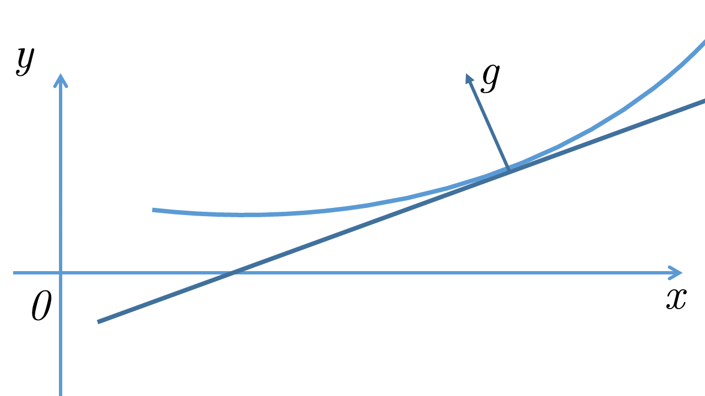
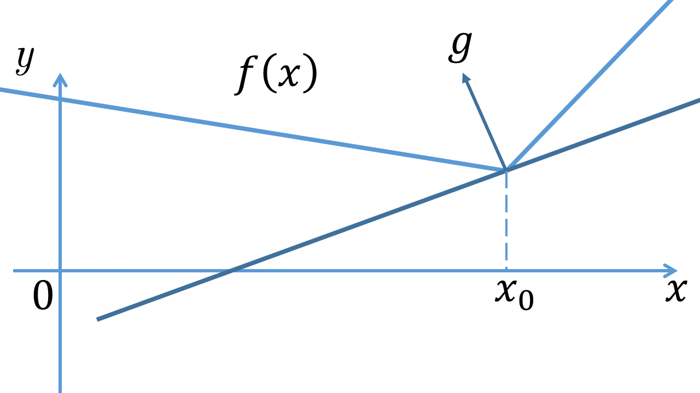

# Методы Оптимизации. Даниил Меркулов. Субградиент. Субдифференциал.

## Directional derivative
### Производная по направлению
Пусть $f(x)$ - выпуклая функция на выпуклом множестве $S \subseteq \mathbb{R}^n$ и пусть $x_0 \in \mathbf{ri} S$. Тогда в $x_0$ существует производная по любому направлению $s \in \mathbf{Lin} S$:
$$
f'(x_0; s) = \lim_{\alpha \to 0+} \dfrac{f(x_0 + \alpha s) - f(x_0)}{\alpha}
$$

### Важные факты о производной по направлению

* Если функция $f(x)$ дифференцируема в точке $x_0$, то ее производная по любому направлению $s \in \mathbb{R}^n$ существует и равна:
$$
f'(x_0; s) = \langle \nabla f(x_0), s\rangle
$$

## Subgradient
### Мотивация
Важным свойством непрерывной выпуклой функции $f(x)$ является то, что в выбранной точке $x_0$ для всех $x \in \text{dom } f$ выполнено неравенство:

$$
f(x)  \geq f(x_0) +  \langle g, x - x_0 \rangle
$$

для некоторого вектора $g$, то есть касательная к графику функции является *глобальной* оценкой снизу для функции. 

* Если $f(x)$ - дифференцируема, то $g = \nabla f(x_0)$
* Не все непрерывные выпуклые функции дифференцируемы :)

Не хочется лишаться такого вкусного свойства.

### Субградиент
Вектор $g$ называется **субградиентом** функции $f(x): S \to \mathbb{R}$ в точке $x_0$,  если $\forall x \in S$:
$$
f(x)  \geq f(x_0) +  \langle g, x - x_0 \rangle
$$

### Субдифференциал
Множество всех субградиентов функции $f(x)$ в точке $x_0$ называется **субдифференциалом** $f$ в $x_0$ и обозначается $\partial f(x_0)$.
* Если $x_0 \in \mathbf{ri } S$, то $\partial f(x_0)$  выпуклое компактное множество.
* Выпуклая функция $f(x)$ дифференцируема в точке $x_0\iff \partial f(x_0) = \nabla f(x_0)$ 
* Если $\partial f(x_0) \neq \emptyset \;\;\; \forall x_0 \in S$, то $f(x)$ - выпукла на $S$. 

### Теорема Моро - Рокафеллара (субдифференциал линейной комбинации)
Пусть $f_i(x)$ - выпуклые функции на выпуклых множествах $S_i, \; i = \overline{1,n}$.  
Тогда, если $\bigcap\limits_{i=1}^n \mathbf{ri } S_i \neq \emptyset$ то функция $f(x) = \sum\limits_{i=1}^n a_i f_i(x), \; a_i > 0$ имеет субдифференциал $\partial_S f(x)$ на множестве $S = \bigcap\limits_{i=1}^n S_i$ и 
$$
\partial_S f(x) = \sum\limits_{i=1}^n a_i \partial_{S_i} f_i(x)
$$

### Важное следствие (субдифференциал максимума)
Пусть $f_i(x)$ - выпуклые функции на открытом выпуклом множестве $S  \subseteq \mathbb{R}^n, \; x_0 \in S$, а поточечный максимум определяется как $f(x)  = \underset{i}{\operatorname{max}} f_i(x)$. Тогда:
$$
\partial_S f(x_0) = \mathbf{conv}\left\{  \bigcup\limits_{i \in I(x_0)} \partial_S f_i(x_0) \right\}
$$
где $I(x) = \{ i \in [1:m]: f_i(x) = f(x)\}$

### Теорема (субдифференциал сложной функции)
Пусть $g_1, \ldots, g_m$ - выпуклые функции на открытом выпуклом множестве $S \subseteq \mathbb{R}^n$, $g = (g_1, \ldots, g_m)$ - образованная из них вектор - функция, $\varphi$ - монотонно неубывающая выпуклая функция на открытом выпуклом множестве $U \subseteq \mathbb{R}^m$, причем $g(S) \in U$. Тогда субдифференциал функции $f(x) = \varphi \left( g(x)\right)$ имеет вид:
$$
\partial f(x) = \bigcup\limits_{p \in \partial \varphi(u)} \left( \sum\limits_{i=1}^{m}p_i \partial g_i(x) \right),
$$
где $u = g(x)$

### Важное следствие
В частности, если функция $\varphi$ дифференцируема в точке $u = g(x)$, то формула запишется так:
$$
\partial f(x) = \sum\limits_{i=1}^{m}\dfrac{\partial \varphi}{\partial u_i}(u) \partial g_i(x)
$$

## Conditional subgradient
### Определение
Множество 
$$
\{ g |  f(x) - f(x_0) \geq \langle g, x - x_0 \rangle, \; \forall x \in S \}
$$
называется **субдифференциалом $f$ в $x_0$ на множестве** $S$ и обозначается $\partial_S f(x_0)$.

## Примеры
Концептуально, различают три способа решения задач на поиск субградиента:
* Теоремы Моро - Рокафеллара, композиции, максимума
* Геометрически
* По определению

### Пример 1  
Найти $\partial f(x)$, если $f(x) = |x|$

### Пример 2
Найти $\partial f(x)$, если $f(x) = |x - 1| + |x + 1| $

### Пример 3
Найти $\partial f(x)$, если $f(x) = \left[ \max(0, f_0(x))\right]^q$. Здесь $f_0(x)$ - выпуклая функция на открытом выпуклом множестве $S$, $q \geq 1$.

Решение:  
Согласно теореме о композиции (функция $\varphi (x) = x^q$ - дифференцируема), а $g(x) = \max(0, f_0(x))$ имеем:
$$\partial f(x) = q(g(x))^{q-1} \partial g(x)$$

По теореме о поточечном максимуме:

$$
\partial g(x) = \begin{cases} \partial f_0(x), \;\;\; f_0(x) > 0,\\ \{0\}, \;\;\;\;\; f_0(x) < 0 \\ \{a \mid a = \lambda a', \; 0 \le \lambda \le 1, \; a' \in \partial f_0(x), \;\; f_0(x) = 0 \} \end{cases}
$$

### Пример 4
Найти $\partial f(x)$, если $f(x) = \sin x, x \in [\pi/2; 2\pi]$

### Пример 5

Найти $\partial f(x)$, если $f(x) = |c_1^Tx| + |c_2^Tx| $

## Домашнее задание 7

1. Докажите, что точка $x_0$ - является точкой минимума выпуклой функции $f(x)$ тогда и только тогда, когда $0 \in \partial f(x_0)$
2. Найти $\partial f(x)$, если $f(x) = \text{ReLU}(x) = \max \{0, x\}$
3. Найти $\partial f(x)$, если $f(x) = \|x\|_p$ при $p = 1,2, \infty$
4. Найти $\partial f(x)$, если $f(x) = \|Ax - b\|_1^2$
5. Найти $\partial f(x)$, если $f(x) = e^{\|x\|}$