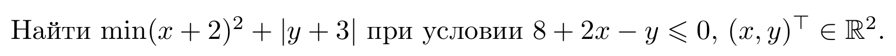
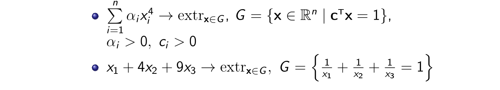
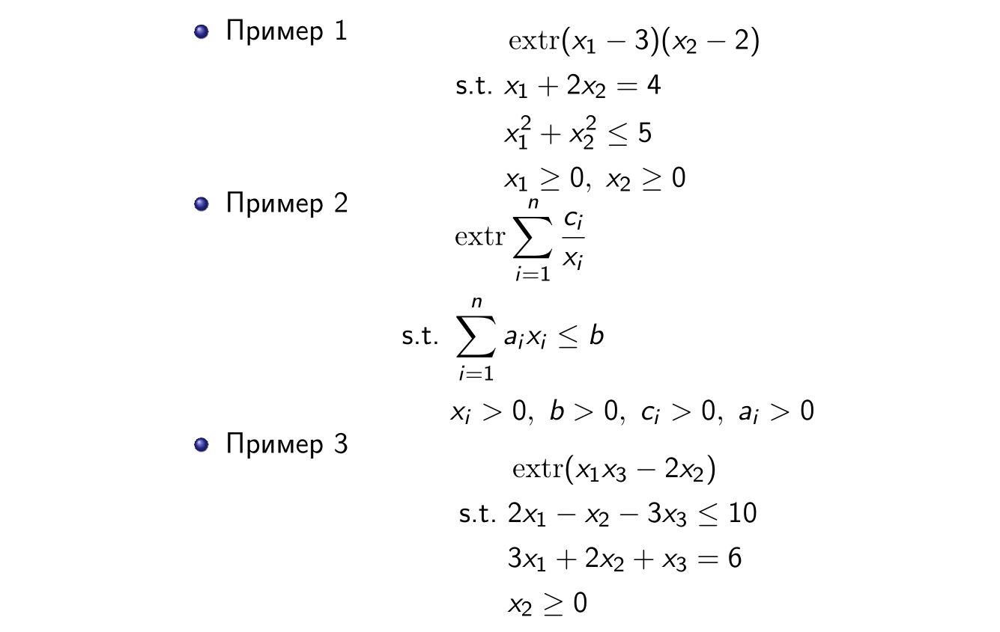

# Методы Оптимизации. Даниил Меркулов. Условия Оптимальности

## Extreme value (Weierstrass) theorem
Пусть $S \subset \mathbb{R}^n$ - компактное множество и пусть $f(x)$ непрерывная функция на $S$. 
Тогда точка глобального минимума функции $f (x)$ на $S$ существует.

## Optimality Conditions
### Общая задача оптимизации

$$
f(x) \to \min\limits_{x \in S}
$$

Будем говорить, что задача имеет решение, если множество таких $x^* \in S$, что в них достигается минимум или инфимум данной задачи **не пусто**

#### Критерий оптимальности
Пусть $f(x)$ определена на множестве $S \subseteq \mathbb{R}^n$.
Тогда 
* если $x^*$ точка минимума $f(x)$ на $S$, то $\partial_S f(x^*) \neq \emptyset$ и $0 \in \partial_S f(x^*)$
* если для некоторой точки $x^* \in S$ существует субдифференциал $\partial_S f(x^*)$ и $0 \in \partial_S f(x^*)$, то $x^*$ - точка минимума $f(x)$ на $S$.

Problemes в том, что подсчет субдифференциала может быть еще сложнее, чем подсчкт градмента. А часто у функций субдифференциала вообще нет во многих точках.

#### Критерий оптимальности выпуклой задачи
Пусть $f(x)$ выпуклая функция на $S \subseteq \mathbb{R}^n$. Тогда точка $x^*$ - решение задачи безусловной минимизации $\Leftrightarrow$ найдется такой вектор 
$$
a \in \partial_S f(x^*) \;\;\;\;\;\; \langle a, x - x^*\rangle \ge 0, \;\; \forall x \in S
$$

### Задача БМ
$$
f(x) \to \min\limits_{x \in \mathbb{R}^n}
$$

#### Достаточное условие
Пусть $f(x)$ дважды дифференцируема на $\mathbb{R}^n$ и $x^*$ такая что $\nabla f(x^*) = 0$. Тогда если 
$$
\nabla^2 f(x^*) \succ 0,
$$
то $x^*$ точка строгого локального минимума $f(x)$ на $\mathbb{R}^n$.  

#### Критерий оптимальности выпуклой задачи
* Пусть $f(x)$ выпуклая функция на $\mathbb{R}^n$. Тогда точка $x^*$ - решение задачи безусловной минимизации $\Leftrightarrow$ 
$$
0 \in \partial f(x^*).
$$
* Пусть $f(x)$ выпуклая дифференцируемая функция на $\mathbb{R}^n$. Тогда точка $x^*$ - решение задачи безусловной минимизации $\Leftrightarrow$ 
$$
0 = \nabla f(x^*).
$$

### Задачи с ограничениями типа равенств
#### Общая формулировка
$$
\begin{split}
& f(x) \to \min\limits_{x \in \mathbb{R}^n} \\
\text{s.t. } & g_i(x) = 0, \; i = 1,\ldots, m 
\end{split}
$$

#### Решение: функция Лагранжа
$$
L(x, \lambda) = f(x) + \sum\limits_{i=1}^m\lambda_i g_i(x)
$$

Пусть $f(x)$ и $g_i(x)$ дважды дифференцируемы в точке $x^*$ и непрерывно дифференцируемы в некоторой окрестности $x^*$. Пусть также $\nabla_x L(x^*, \lambda) = 0$. Тогда если $h^{T}\nabla^2 L(x^*, \lambda)h > 0$, где $h \in T(x^*|S)$ -  касательный конус, то $x^*$ -  точка локального минимума.

### Задачи с ограничениями типа неравенств
#### Общая формулировка
$$
\begin{split}
& f(x) \to \min\limits_{x \in \mathbb{R}^n}\\
\text{s.t. } & g_i(x) = 0, \; i = 1,\ldots,m\\
& h_j(x) \leq 0, \; j = 1,\ldots, p
\end{split}
$$
Данная формулировка представляет собой общую задачу математического программирования.

#### Решение: регулярная функция Лагранжа
$$
L(x, \lambda, \mu) = f(x) + \sum\limits_{i=1}^m\lambda_i g_i(x) + \sum\limits_{j=1}^p \mu_j h_j(x)
$$

#### Условия (необходимые) Каруша  Куна Таккера:
Пусть $x^*$ решение задачи математического программирования, и функции $f, h_j, g_i$ дифференцирумы. 
Тогда найдутся такие $\mu^*$ и $\lambda^*$, что выполнены следующие условия:
* $g_i(x^*) = 0$
* $h_j(x^*) \leq 0$
* $ \mu^*_j \geq 0$
* $\mu^*_jh_j(x^*) = 0$
* $\nabla_x L(x^*, \lambda^*, \mu^*) = 0$

В выпуклом случае эти условия являются достаточными!

#### Достаточные условия первого порядка
Если для стационарной точки $(x^*, \lambda^*, \mu^*)$ число активных неравенств $|J|$ такое что $n = m + |J|$ и $\mu_j > 0, \; j \in J$, то эта точка является точкой минимума.
#### Достаточные условия второго порядка
Если в задаче математического программирования число активных ограничений меньше размерности задачи, то точка $x^*$ яляется решением задачи, если выполнены условия
$$
z^{T}\nabla_{xx}^2 L(x^*)z > 0
$$
для 
* $z \neq 0$ и $\nabla g^{T}_i(x^*)z = 0$
* при $j \in J$ и $\mu_j > 0$, $\nabla h^{T}_j(x^*) z = 0$
* при $j \in J$ и $\mu_j = 0$, $\nabla h^{T}_j(x^*) z \leq 0$

## Примеры
### Пример 1  

### Пример 2 (безусловная минимизация)

### Пример 3 (ограничения типа равенств)

### Пример 4 (ограничения типа неравенств)

## Take home message
* Любой локальный минимум выпуклой задачи - глобальный
* В сильно выпуклой задаче локальный минимум единственный
* Условия Каруша Куна Таккера - прекрасный способ решать задачи математического программирования. В выпуклом случае он еще и дает гарантии.