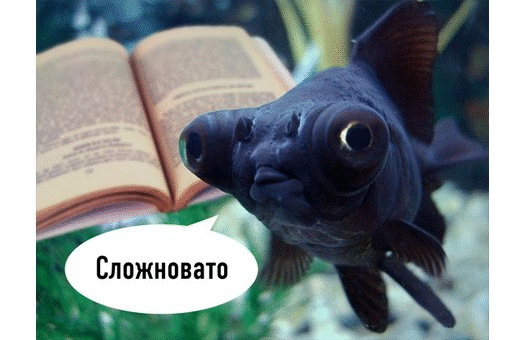
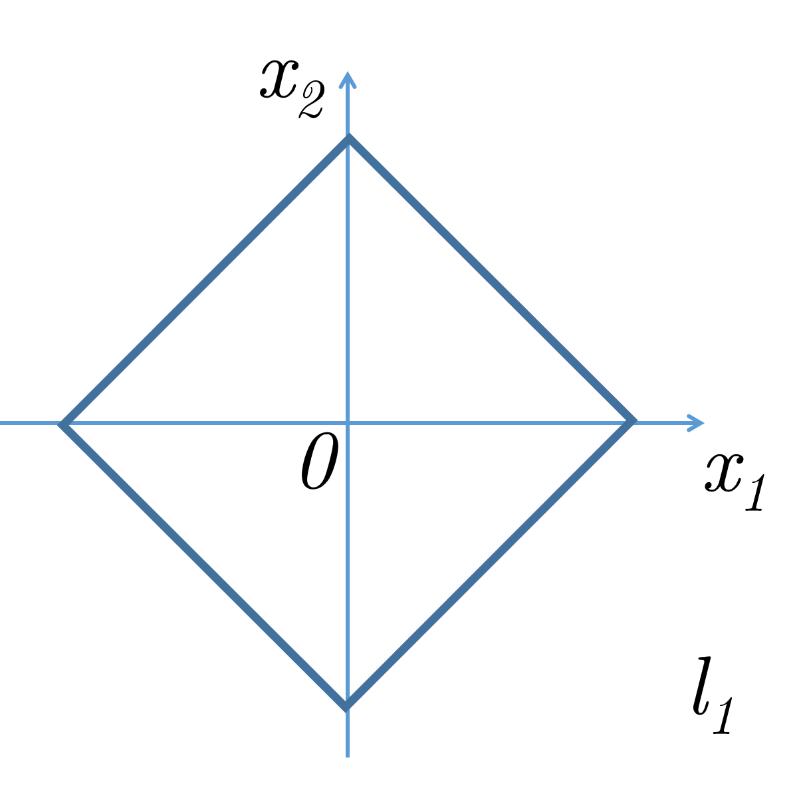
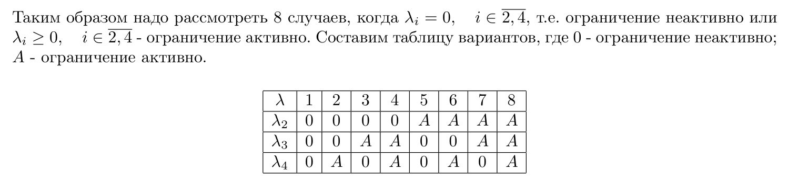

# Методы Оптимизации. Даниил Меркулов. Оптимизация for dummies

Задача преподавателя: избежать подобных ситуаций 

## Задача 1
Доказать, что для того, чтобы $S \subseteq \mathbb{R}^n$ было афинным множеством необходимо и достаточно, чтобы $S$ содержало все возможные афинные комбинации своих точек.

Идея:
* Пусть $S$ содержит все афинные комбинации своих точек $\to$ $S$ - афинно
  Достаточно очевидно.
* Пусть $S$ - афинно $\to$ $S$ содержит все афинные комбинации своих точек
  Доказывать по индукции. Проверить для одного, поверить для $k$ доказать для $k+1$

## Задача 2
Доказать, что для того, чтобы $K \subseteq \mathbb{R}^n$ было выпуклым конусом необходимо и достаточно, чтобы $K$ содержало все возможные неотрицательные комбинации своих точек.

Идея:
* Пусть $K$ содержит все конические комбинации своих точек $\to$ $K$ - выпуклый конус
  Достаточно очевидно.
* Пусть $K$ - выпуклый конус $\to$ $K$ содержит все конические комбинации своих точек
  Доказывать по индукции. Проверить для одного, поверить для $k$ доказать для $k+1$

## Задача 3
Найти проекцию точки $y \in \mathbb{R}^n$ на афинное множество $S = \left\{ x \in \mathbb{R}^n \mid x = Ay, y \in \mathbb{R}^m, A \in \mathbb{R}^{n \times m} \right\},$ $ \;\;\; m < n, \;\;\; \text{rank}\; A = m, \;\; y \notin S$

Идея:
* Интуиция в том, что это чистейший метод наименьших квадратов в линейном случае.
$$
A^T c = 0, \;\;\; \pi_S(y) = \pi = y + \beta c
$$
* Докажем с помощью критерия, что проекция будет искаться в таком виде:
$$
\pi = A \cdot (A^TA)^{-1}A^Ty
$$
* Так как целевое множество - афинно, то необходимо и достаточно показать:
$$
\left( \pi - y \right)^T \left( x - \pi \right) = 0
$$

## Задача 4
Найти проекцию $\pi_S(y)$ точки $y$ множество $S = \{x_1, x_2 \in \mathbb{R}^2 \mid |x_1| + |x_2| = 1 \}$ в $\| \cdot \|_1$ норме. Рассмотреть различные положения $y$.

Идея:
* 

## Задача 5
Используя лемму о конусе, сопряженному к сумме конусов и лемму о конусе, сопряженном к пересечению замкнутых выпуклых конусов, доказать, что конусы
$$
K_1 = \{x \in \mathbb{R}^n \mid x = Ay, y \ge 0, y \in \mathbb{R}^m, A \in \mathbb{R}^{n \times m} \}, \;\; K_2 = \{ p \in \mathbb{R}^n \mid A^Tp \ge 0\}
$$
взаимодвойственны

## Задача 6
Найти множества $S^{*}, S^{**}, S^{***}$, если 
$$
S = \{ x \in \mathbb{R}^2 \mid x_1 + x_2 \ge 0, \;\; 2x_1 + x_2 \ge -4, \;\; -2x_1 + x_2 \ge -4\}
$$

Идея:
* Представить множество как выпуклую + коническую оболочку точек и применить теорему.

## Задача 7
Проверить, что функция $f(x) = \sqrt{1 + x^Tx}$ выпукла на $\mathbb{R}^n$. Будет ли она строго выпуклой?

Идея:
* Использовать критерий второго порядка

## Задача 8
Для каких значений $x \in \mathbb{R}^3$ функция $f(x) = \dfrac{x_1^3}{3} + \dfrac{x_1 x_2^2 + x_1 x_3^2}{2}$ выпукла и строго выпукла?

Идея:
* Использовать критерий второго порядка

## Задача 9
Пусть задана функция двух переменных:
$$
f(x,y) = \max\left\{|x - 1| + e^{|y-1|}, |x - y - 1|\right\}
$$
Кроме того, есть множество:
$$
S = \left\{(x,y)^T \in \mathbb{R}^2 \mid y \ge 1, x - y \ge 0\right\}
$$
Найти $\partial f(A), \partial_S f(A)$, если $A = (1,1)^T$.

## Задача 10
Используя условие оптимальности $0 \in \partial_S f(x_*)$, решить задачу
$$
\begin{split}
& \mathrm{min} \ |x| + |y|\\
\text{s.t. } & (x-1)^2 + (y-1)^2 \leq 1 
\end{split} 
$$

## Задача 11
Даня Чернявский всю сознательную жизнь торговал криптовалютой. В определенный момент ему показалось, что он выучил оптимизацию и он может подойти к задаче формирования криптопортфеля с умом. У него имелись на выбор криптовалюты, индексируемые $1, \ldots, C$. Текущие курсы криптовалют к рублю: $\lambda_1, \ldots, \lambda_C$. Для Дани существует лишь два исхода: криптовалюта вырастет в $\dfrac{\pi}{e}$ раз - успех и провал в других случаях. Пользуясь секретными телеграм чатами, он сумел оценить вероятности успеха для каждой криптовалюты как $p_1, \ldots, p_C$. Однако, Даня -  бедный трейдер и имеет ограниченный бюджет, составляющий $z$ рублей. Давайте поможем сформулировать оптимизационную задачу выбора инвестиционного криптопортфеля Дане так, чтобы максимизировать средний выигрыш. Является ли эта задача выпуклой, если она, конечно, разрешима?

## Задача 12

Идея:

